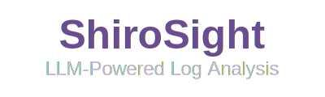

<div align="center">
  <br />
  
</div>
<div align="center">
<b>
<a href="docs/installation.md">Installation</a> | <a href="docs/configuration.md">Configuration</a> | <a href="docs/usage.md">Usage</a> | <a href="docs/examples.md">Example</a> | <a href="docs/contributing.md">Contributing</a>
</b>
</div>
<br>
<hr>

ShiroSight is an open-source tool for log analysis powered by Large Language Models. It leverages serverless functions and workflows (both DAG and non-DAG) to process and analyze logs using models from providers like OpenAI, Claude, and others. ShiroSight helps teams extract meaningful insights from their log data without the need for complex infrastructure management.

## Key Features

ShiroSight offers the following key features:

- **Easy Deployment**: All you need is a cloud account (AWS, GCP, Azure, etc.) or a Kubernetes cluster. If you have access to LLM APIs, you can deploy immediately without additional setup or costs beyond cloud infrastructure expenses.
- **Serverless Architecture**: Use resources only when needed without the burden of infrastructure management.
- **Multiple LLM Support**: Leverage various LLM providers including OpenAI, Claude, and others.
- **Scalable Workflows**: Configure complex log analysis pipelines through both DAG and non-DAG workflows.

# Installation

For quick deployment, follow these steps:

```bash
aws sso login
cd deployments/terraform
terraform init
terraform apply 
```

Or, see [Installation](./docs/installation.md) to get more information

# License

